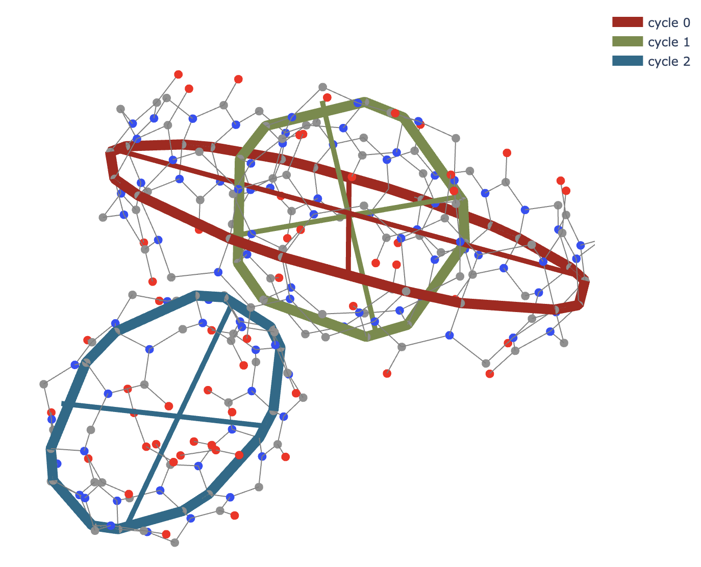

# ElliptiCBn

## Automatically measure the ellipticity of cucurbituril macrocycles


### Run on Google Colab

Run the program in the cloud without installing any software. 

<a href="https://githubtocolab.com/harmslab/ElliptiCBn/blob/main/notebooks/ElliptiCBn.ipynb" target="_parent"></a>


### Description

*ElliptiCBn is a collaboration between the Pluth and Harms labs at the University of Oregon*

Arman Garcia, Michael Shavlik PhD, Mike Harms PhD, Mike Pluth PhD

A manuscript describing the software is forthcoming.


#### ElliptiCBn performs the following steps


1. Extract the coordinates of all heavy (non-hydrogen) atoms from an xyz file.

2. Identify separate molecules by finding strongly-connected components.

3. Identify candidate hosts by filtering on aspect ratio, which differentiates between long, skinny molecules and short, fat molecules.

4. Identify the central macrocycle of each host by finding carbons that do not form carbon-oxygen bonds. The cycle identity is further validated by the number of carbons and their connectivity.

5. Use a Principal Component Analysis to calculate the variance along both major axes of the central cycle.

6. Calculate ellipticity. This is done by two methods:

   A.  *pca_ellip*: $(V_{ax1}-V_{ax2})/V_{ax1}$ where $V_{ax1}$ is the PCA variance on the longest axis (length) and $V_{ax2}$ is the PCA variance on the second-longest axis (width).  

   B.  *orig_ellip*: Use the perimeter and largest carbon-to-centroid distance to infer ellipticity.

7. Generate outputs, which include annotated structures and a spreadsheet with ellipticities.

### Input

ElliptiCBn takes molecular structures in [XYZ format](https://en.wikipedia.org/wiki/XYZ_file_format). The first two lines are ignored. We assume the coordinates are in angstroms. XYZ files can be generated from other structure formats using software like [Open Babel](http://openbabel.org). 

### Output

Output of a calculation using the structure [HUXMAR](https://dx.doi.org/10.5517/ccdc.csd.cc261f8z) as input.

#### Ellipticity table

| id   | size | pca_ellip | orig_ellip |
| ---- | ---- | --------- | ---------- |
| 0    | 20   | 0.121369  | 0.123284   |
| 1    | 10   | 0.018906  | 0.066456   |
| 2    | 14   | 0.075018  | 0.087605   |

#### Annotated structure

A screenshot of the output follows. The actual output of the code is interactive. An example is [here](images/exmar_huxmar-page.html). 



### Local installation

ElliptiCBn can be installed locally and used as a command line tool. 

**To install using pip**

On a terminal, run:

```bash
pip install ElliptiCBn
```

**To install from source:**

On a terminal, run:

```bash
git clone https://github.com/harmslab/ElliptiCBn.git
cd ElliptiCBn
python -m pip install . -vv
```

### Run from the command line

ElliptiCBn takes one or more .xyz files as inputs. Assuming that HUMAR.xyz is in the working directory, running this command:

```
$> ElliptiCBn HUMXAR.xyz
```

Would generate the following output:

```
Analyzing HUMXAR.xyz.
3 macrocycles identified.

Calculating ellipticities for 3 macrocycles.

Results:
    id  size  pca_ellip  orig_ellip
0  0.0    20   0.121369    0.123284
1  1.0    10   0.018906    0.066456
2  2.0    14   0.075018    0.087605

Saving plot to ./HUMXAR.xyz.html
```

It will also generate HUXMAR.xyz.html (the visualization) and HUXMAR.xyz.xlsx (the ellipticity table) in the current directory. 

You can also run the program on multiple xyz files:

```
$> ElliptiCBn HUMXAR.xyz LAZPIM.xyz
```

Would generate the following output:

```
Analyzing HUMXAR.xyz.
3 macrocycles identified.

Calculating ellipticities for 3 macrocycles.

Results:
    id  size  pca_ellip  orig_ellip
0  0.0    20   0.121369    0.123284
1  1.0    10   0.018906    0.066456
2  2.0    14   0.075018    0.087605

Saving plot to ./HUMXAR.xyz.html
Analyzing LAZPIM.xyz.
1 macrocycles identified.

Calculating ellipticities for 1 macrocycles.

Results:
    id  size  pca_ellip  orig_ellip
0  0.0    20    0.29813    0.212848

Saving plot to ./LAZPIM.xyz.html
```

In addition to the visualization html and individual ellipiticty files, this call would generate a single spreadsheet ("summary.xlsx") that has all calculated ellipticities:

| id   | size | pca_ellip | orig_ellip | file       |
| ---- | ---- | --------- | ---------- | ---------- |
| 0    | 20   | 0.121369  | 0.123284   | HUMXAR.xyz |
| 1    | 10   | 0.018906  | 0.066456   | HUMXAR.xyz |
| 2    | 14   | 0.075018  | 0.087605   | HUMXAR.xyz |
| 0    | 20   | 0.29813   | 0.212848   | LAZPIM.xyz |

One can also change the parameters used in the calculation. To see the available options, type the following in a terminal:

```bash
ElliptiCBn --help
```

As of this writing (version 1.2.1), this gives the following output:

```
usage: ElliptiCBn [-h] [--bond_dist BOND_DIST]
                  [--aspect_ratio_filter ASPECT_RATIO_FILTER]
                  [--oxygen_dist_cutoff OXYGEN_DIST_CUTOFF]
                  [--min_num_carbons MIN_NUM_CARBONS]
                  [--max_num_carbons MAX_NUM_CARBONS]
                  [--min_cycle_cc_bond_length MIN_CYCLE_CC_BOND_LENGTH]
                  [--max_cycle_cc_bond_length MAX_CYCLE_CC_BOND_LENGTH]
                  [--summary_file SUMMARY_FILE] [--output_dir OUTPUT_DIR]
                  [--overwrite]
                  filename [filename ...]

    Wrapper function that runs a complete ElliptiCbn calculation.

    Parameters
    ----------
    filename : str or list
        xyz file name (or list of xyz files) to read
    bond_dist : float, default=2.5
        any atoms closer than bond distance (in angstroms) are identified as
        part of a single molecule
    aspect_ratio_filter : float, default=3
        reject any identified cycles that have a PCA aspect ratio greater than
        aspect_ratio_filter. An aspect ratio of 1 corresponds to a square; an
        aspect ratio of 10 would be long and skinny.
    oxygen_dist_cutoff : float, default=2.9
        when selecting the central cucurbituril macrocycle, identify carbons by
        removing any carbon closer than oxygen_dist_cutoff to an oxygen
    min_num_carbons : int, default=10
        reject any macrocycle with a central cycle that has less than
        min_num_carbons
    max_num_carbons : int, default=10
        reject any macrocycle with a central cycle that has more than
        max_num_carbons
    min_cycle_cc_bond_length: float, default=1.3
        minimum length to identify cc bonds in the macrocycle
    max_cycle_cc_bond_length: float, default=1.7
        maximum length to identify cc bonds in the macrocycle
    summary_file : str, default="summary.csv"
        write all cycles to this single summary file if there is more than one
        xyz file specified.
    output_dir : str, default="."
        write output to output_dir.
    overwrite : bool, default=False
        overwrite existing output files


positional arguments:
  filename

optional arguments:
  -h, --help            show this help message and exit
  --bond_dist BOND_DIST
  --aspect_ratio_filter ASPECT_RATIO_FILTER
  --oxygen_dist_cutoff OXYGEN_DIST_CUTOFF
  --min_num_carbons MIN_NUM_CARBONS
  --max_num_carbons MAX_NUM_CARBONS
  --min_cycle_cc_bond_length MIN_CYCLE_CC_BOND_LENGTH
  --max_cycle_cc_bond_length MAX_CYCLE_CC_BOND_LENGTH
  --summary_file SUMMARY_FILE
  --output_dir OUTPUT_DIR
  --overwrite
```
