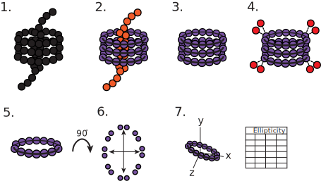

# ElliptiCBn - an automated command line tool for visualizing and measuring ellipticity of cucurbituril host/guest structures

 

## Run on Google Colab
Run the program in the cloud without installing any software. 

## How to install
**In a terminal, the command for installation is a simple**

_pip install ElliptiCBn_

**To install from source:**

* `git clone https://github.com/harmslab/ElliptiC.git`
* `cd Elliptic`
* `python -m pip install . -vv`

 

## How to run the analysis
### The ElliptiCBn package takes a single command line argument: an xyz file containing atom coordinates, or a folder of xyz files containing atom coordinates

**To run the analysis package on a single file, navigate to the directory with the ElliptiCBn script and execute it:**
(NOTE: if there are spaces in your file name, you will need quotes around the file name)

**The same convention can be used to execute the package on a folder of xyz files**

    
 

## How the package works
### We analyze ellipticity using seven steps

1. Extract the coordinates of all heavy (non-hydrogen) atoms from an xyz file. 

2. Identify separate molecules by finding strongly-connected components. 

3. Identify candidate hosts by filtering on aspect ratio, which differentiates between long, skinny molecules and short, fat molecules. 

4. Using the location of oxygen atoms on the molecule, identify the central macrocycle. Its identity is further validated by the number of carbons and their connectivity. 
4. Use a Principal Component Analysis to calculate the variance along both major axes of the host ring. 
6. Calculate ellipticity. This is done by two methods:
   1.  *pca_ellip*: $(V_{ax1}-V_{ax2})/V_{ax1}$ where $V_{ax1}$ is the variance on the longest axis (length) and $V_{ax2}$​​ is the variance on the second-longest axis (width).  
   2. *orig_ellip*: Use centroids.... xx 
7. Generate outputs, which include annotated structures and a spreadsheet with ellipticities. 

 
 

## Output

* Html file
* 1 interactive 3D scatter plot with only the central carbon ring of the CBn structures visualized
* 1 spreadsheet with all of the carbons, their positions, distance to the centroid of the structure, and the measured ellipticity

**In the case of host CBn structures with an internally situated guest structure, an additional 3D graph will be produced with the guests visualized in the structures (see below)**

To see the interactive version of this plot that gets generated from the script, [Click Here](https://plotly.com/~Mshavlik/63/)

**The user can visually see the ellipticity in the structues and compare them to the measured values in the spreadsheets:**                 
_CB7 structures from above with guests removed_

Calculated ellipticity for each structure on a scale of circular (0) to linear (1)  

_CB10 wide structures with guests removed_

Calculated ellipticity for each structure on a scale of circular (0) to linear (1)  

